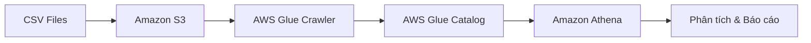
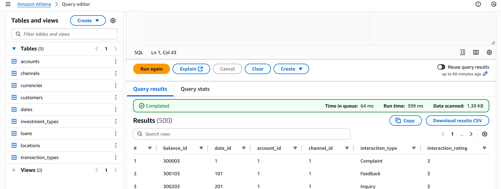

# 🏦 Dự Án Kho Dữ Liệu AWS


Dự án này xây dựng một kho dữ liệu tài chính toàn diện trên Amazon Athena, ## 🔗 Kết Nối Các Dịch Vụ AWS

Dự án này sử dụng sức mạnh của nhiều dịch vụ AWS k## 📐 Khả Năng Mở Rộng của Tech Stack

Tech stack được chọn trong dự án này đảm bảo khả năng mở rộng ở nhiều cấp độ:

### 🔄 Tính Linh Hoạt & Mở Rộng

| Yếu tố                    | Giải pháp           | Lợi ích                                              |
| ------------------------- | ------------------- | ---------------------------------------------------- |
| **Khối lượng dữ liệu**    | S3 + Athena         | Mở rộng từ GB đến PB mà không cần thay đổi kiến trúc |
| **Hiệu suất truy vấn**    | Parquet + Phân vùng | Tự động cải thiện khi áp dụng tối ưu hóa             |
| **Đa dạng nguồn dữ liệu** | AWS Glue            | Dễ dàng thêm nguồn dữ liệu mới vào pipeline          |
| **Khả năng phục hồi**     | Dịch vụ quản lý AWS | Tự động phục hồi lỗi và sao lưu dữ liệu              |
| **Tích hợp BI**           | Athena APIs         | Kết nối với Power BI, Tableau, QuickSight            |

### 🔍 So Sánh với Các Giải Pháp Thay Thế

| Giải pháp          | Ưu điểm                                            | Nhược điểm                              | Lý do chọn/không chọn                       |
| ------------------ | -------------------------------------------------- | --------------------------------------- | ------------------------------------------- |
| **AWS Redshift**   | Hiệu suất cao với các tập dữ liệu lớn              | Chi phí cao hơn, yêu cầu quản lý cụm    | Không cần cho khối lượng công việc hiện tại |
| **Snowflake**      | Tự động mở rộng, phân tách lưu trữ và tính toán    | Chi phí cao, không tích hợp sâu với AWS | Muốn duy trì tất cả dịch vụ trong AWS       |
| **BigQuery**       | Serverless, hiệu suất tốt                          | Chỉ có trên Google Cloud                | Đã cam kết với hệ sinh thái AWS             |
| **✅ S3 + Athena** | Serverless, chi phí thấp, chỉ trả tiền khi sử dụng | Giới hạn độ phức tạp của truy vấn       | Phù hợp với yêu cầu, chi phí tối ưu         |

## 📚 Tài Nguyên Bổ Sung

- [Tài liệu Amazon Athena](https://docs.aws.amazon.com/athena/latest/ug/what-is.html)
- [AWS Glue Data Catalog](https://docs.aws.amazon.com/glue/latest/dg/what-is-glue.html)
- [ETL với AWS Glue](https://docs.aws.amazon.com/glue/latest/dg/what-is-glue.html)
- [Tối ưu hóa truy vấn Athena](https://docs.aws.amazon.com/athena/latest/ug/performance-tuning.html)
- [Định dạng Parquet](https://parquet.apache.org/)
- [So sánh các giải pháp kho dữ liệu](https://aws.amazon.com/blogs/big-data/top-10-performance-tuning-tips-for-amazon-athena/)
- [AWS Architecture Center - Data Lake](https://aws.amazon.com/architecture/data-lake/)với nhau để tạo nên một giải pháp kho dữ liệu toàn diện:

### 📦 Amazon S3 (Simple Storage Service)

- Lưu trữ dữ liệu gốc dưới dạng CSV và dữ liệu chuyển đổi dưới dạng Parquet
- Tổ chức theo cấu trúc thư mục phân cấp để quản lý hiệu quả
- Ví dụ đường dẫn: `s3://luvutu-s3/dimension/customers/`, `s3://luvutu-s3/fact/transaction/year=2025/month=06/`
- **Lợi ích**:
  - Khả năng mở rộng không giới hạn với độ bền 99.999999999%
  - Chi phí lưu trữ thấp với nhiều lớp (tiers) để tối ưu hóa chi phí
  - Tích hợp tự nhiên với các dịch vụ phân tích AWS khácác bảng chiều (dimension) đã được tải vào hệ thống và xây dựng các bảng sự kiện (fact) để phục vụ phân tích tài chính. Kho dữ liệu cho phép phân tích các giao dịch, số dư tài khoản, tương tác khách hàng, thanh toán khoản vay và đầu tư thông qua thiết kế mô hình hình sao (star schema) có cấu trúc tốt.

## �️ Tech Stack

| Công nghệ                                                                                                       | Phiên bản        | Mục đích sử dụng                            |
| --------------------------------------------------------------------------------------------------------------- | ---------------- | ------------------------------------------- |
|  Amazon S3             | Dịch vụ mới nhất | Lưu trữ dữ liệu gốc (CSV) và đích (Parquet) |
|            | Dịch vụ mới nhất | Crawl dữ liệu và quản lý metadata           |
|  | Dịch vụ mới nhất | Phân tích dữ liệu trên S3 bằng SQL          |
|   | 1.12.0           | Định dạng lưu trữ cột tối ưu hóa            |
|                              | ANSI SQL         | Truy vấn dữ liệu và tạo views               |
|                     | 3.9+             | ETL scripts và tự động hóa (tùy chọn)       |

Dự án áp dụng kiến trúc **serverless** để tối ưu chi phí vận hành, chỉ thanh toán khi thực hiện truy vấn dữ liệu. Các công cụ AWS đã được tích hợp chặt chẽ để tạo ra một pipeline dữ liệu đầy đủ từ nguồn tới phân tích.

## �📋 Tổng Quan Dự Án

Kho dữ liệu tuân theo **thiết kế mô hình hình sao** với các bảng chiều ở trung tâm của kiến trúc, kết nối với nhiều bảng sự kiện lưu trữ dữ liệu định lượng, đo lường về hoạt động kinh doanh. Cấu trúc này tối ưu hóa hiệu suất truy vấn và đơn giản hóa báo cáo kinh doanh.

### 🔄 Luồng Dữ Liệu

Dự án này tuân theo luồng xử lý dữ liệu như sau:



1. **CSV Files**: Dữ liệu nguồn từ các hệ thống nghiệp vụ được chuẩn bị dưới dạng CSV
2. **Amazon S3**: Tải dữ liệu CSV lên các bucket S3 được tổ chức theo cấu trúc thư mục
3. **AWS Glue Crawler**: Quét dữ liệu để xác định schema và tự động tạo metadata
4. **AWS Glue Catalog**: Lưu trữ metadata, cấu trúc bảng, và thông tin định nghĩa dữ liệu
5. **Amazon Athena**: Truy vấn dữ liệu trực tiếp từ S3 sử dụng metadata từ Glue Catalog
6. **Phân tích & Báo cáo**: Sử dụng các view phân tích được xây dựng để tạo insights

### ⭐ Kiến Trúc Mô Hình Hình Sao

#### Sơ đồ ERD của Kho Dữ Liệu


_Sơ đồ ERD (Entity Relationship Diagram) của kho dữ liệu, hiển thị các bảng chiều (dimension) và bảng sự kiện (fact) cùng các mối quan hệ giữa chúng._

```
                                 ┌─────────────┐
                        ┌────────┤ dim_channel ├───────┐
                        │        └─────────────┘       │
                        │                              │
                ┌───────▼──────┐               ┌───────▼──────┐
      ┌─────────┤ dim_customer ├───────┐       │ dim_location │
      │         └───────┬──────┘       │       └───────┬──────┘
      │                 │              │               │
┌─────▼─────┐     ┌────▼─────┐    ┌───▼───┐    ┌──────▼──────┐
│ dim_date  ├─────► fact_    │    │ dim_  ├────► fact_daily_ │
└─────┬─────┘     │transaction◄────┤account│    │balance      │
      │           └────┬─────┘    └───┬───┘    └──────┬──────┘
      │                │              │               │
┌─────▼─────┐    ┌────▼─────┐   ┌────▼────┐   ┌──────▼──────┐
│dim_currency├────► fact_    │   │ dim_   ├───► fact_loan_   │
└─────┬─────┘    │investment │   │loan    │   │payment      │
      │          └────┬─────┘   └────┬────┘   └──────┬──────┘
      │               │              │               │
┌─────▼─────┐   ┌────▼─────┐   ┌────▼────┐   ┌──────▼──────┐
│dim_invest_│   │fact_cust_│   │dim_trans│   │             │
│type       ├───►interaction│   │_type   ├───►             │
└───────────┘   └──────────┘   └────────┘   └─────────────┘
```

### 🧩 Thành Phần Cốt Lõi

- **Bảng Chiều (Dimension Tables)**: Định nghĩa các thực thể kinh doanh và cung cấp ngữ cảnh

  - `customers` - Thông tin liên hệ và nhân khẩu học của khách hàng
  - `accounts` - Chi tiết tài khoản tài chính
  - `dates` - Thông tin ngày tháng cho phân tích theo thời gian
  - `channels` - Kênh tương tác khách hàng (Online Banking, Mobile App, ATM, Branch)
  - `transaction_types` - Các loại giao dịch tài chính (Nạp tiền, Rút tiền, Chuyển khoản, Thanh toán)
  - `locations` - Dữ liệu vị trí địa lý
  - `currencies` - Thông tin tiền tệ
  - `loans` - Chi tiết sản phẩm vay
  - `investment_types` - Loại sản phẩm đầu tư (Cổ phiếu, Trái phiếu, Quỹ tương hỗ, ETF)

- **Bảng Sự Kiện (Fact Tables)**: Lưu trữ dữ liệu định lượng, đo lường về hoạt động kinh doanh
  - `fact_transaction` - Ghi nhận tất cả các giao dịch tài chính
  - `fact_daily_balance` - Ảnh chụp số dư tài khoản hàng ngày
  - `fact_customer_interaction` - Sự kiện dịch vụ khách hàng và tương tác
  - `fact_loan_payment` - Ghi nhận các giao dịch thanh toán khoản vay
  - `fact_investment` - Ghi nhận giao dịch đầu tư

## 🚀 Bắt Đầu

### 📋 Yêu Cầu Tiên Quyết

1. **Tài khoản AWS với các dịch vụ:**

   - ✅ Amazon Athena - Dùng cho phân tích dựa trên SQL
   - ✅ Amazon S3 - Dùng cho lưu trữ dữ liệu
   - ✅ AWS Glue - Dùng cho quản lý catalog

2. **Dữ liệu hiện có:**

   - ✅ Các bảng chiều đã được tải vào Athena
   - ✅ Bucket S3 với quyền IAM thích hợp để lưu trữ bảng sự kiện

3. **Công cụ phát triển:**
   - ✅ Truy cập vào AWS Management Console
   - ✅ Kiến thức cơ bản về SQL
   - ✅ Hiểu biết về mô hình dữ liệu hình sao (star schema)

### 📂 Cấu Trúc Tệp Dự Án

```
AWS-DataWarehouse-Project/
├── create_datawarehouse.sql    # Script SQL chính để tạo kho dữ liệu
├── athena_execution_guide.md   # Hướng dẫn từng bước để chạy script trong Athena
├── README.md                   # Tài liệu dự án (tệp này)
├── accounts/                   # Dữ liệu bảng chiều cho tài khoản
├── channels/                   # Dữ liệu bảng chiều cho kênh
├── currencies/                 # Dữ liệu bảng chiều cho tiền tệ
├── customers/                  # Dữ liệu bảng chiều cho khách hàng
├── dates/                      # Dữ liệu bảng chiều cho ngày tháng
├── investment_types/           # Dữ liệu bảng chiều cho loại đầu tư
├── loans/                      # Dữ liệu bảng chiều cho khoản vay
├── locations/                  # Dữ liệu bảng chiều cho vị trí
└── transaction_types/          # Dữ liệu bảng chiều cho loại giao dịch
```

### ⚙️ Quy Trình ETL và Các Bước Thiết Lập

#### 🔄 Quy Trình ETL Tổng Quan


1. **Extract (Trích xuất):**

   - Dữ liệu được thu thập từ các hệ thống nguồn và xuất ra dưới dạng tệp CSV
   - Mỗi loại dữ liệu được tổ chức vào các thư mục riêng biệt (customers, accounts, v.v.)

2. **Transform (Chuyển đổi):**

   - AWS Glue Crawler phân tích tệp CSV để xác định schema và tạo bảng trong Glue Data Catalog
   - Chuyển đổi dữ liệu từ định dạng CSV sang Parquet (tối ưu hóa cho phân tích)
   - Trong các bảng fact, thực hiện các phép join và tính toán cần thiết thông qua Athena SQL

3. **Load (Tải):**
   - Dữ liệu Parquet được lưu trữ trong S3 theo cấu trúc được phân vùng (theo năm, tháng)
   - Các bảng fact và view phân tích được tạo để phục vụ các truy vấn phân tích

#### 📋 Các Bước Thiết Lập Chi Tiết

1. **Chuẩn bị lưu trữ S3**

   - Tạo bucket S3 để lưu trữ dữ liệu bảng sự kiện
   - Tổ chức cấu trúc thư mục cho các bảng dimension và fact
   - Đảm bảo các quyền thích hợp được thiết lập

   ```
   aws s3 mb s3://luvutu-s3
   aws s3api put-bucket-policy --bucket luvutu-s3 --policy file://bucket-policy.json

   # Tạo cấu trúc thư mục
   aws s3 cp --recursive ./customers/ s3://luvutu-s3/dimension/customers/
   aws s3 cp --recursive ./accounts/ s3://luvutu-s3/dimension/accounts/
   # ... tương tự cho các thư mục dimension khác
   ```

2. **Cài đặt AWS Glue Crawler**

   - Tạo một AWS Glue Crawler để tự động phát hiện cấu trúc dữ liệu từ các tệp CSV
   - Cấu hình crawler để quét các thư mục dimension trong bucket S3
   - Chạy crawler để tạo các bảng dimension trong AWS Glue Data Catalog

   ```bash
   # Sử dụng AWS CLI để tạo một Glue Crawler (hoặc qua console)
   aws glue create-crawler \
     --name "financial-dw-dimension-crawler" \
     --role "AWSGlueServiceRole-FinancialDW" \
     --database-name "financial_dw" \
     --targets '{"S3Targets": [{"Path": "s3://luvutu-s3/dimension/"}]}'

   # Chạy crawler
   aws glue start-crawler --name "financial-dw-dimension-crawler"
   ```

3. **Cập nhật cấu hình trong script SQL**

   - Mở `create_datawarehouse.sql` và cập nhật:
     - Đường dẫn bucket S3: Thay thế `s3://luvutu-s3/fact_transaction/` bằng bucket của bạn
     - Tên cơ sở dữ liệu: Thay thế `luvutu-database` bằng tên cơ sở dữ liệu Athena của bạn

4. **Thực thi trong Athena Query Editor**

   - Bước 1: Tạo cơ sở dữ liệu
     ```sql
     CREATE DATABASE IF NOT EXISTS dw;
     ```
   - Bước 2: Tạo bảng sự kiện ngoài (external fact tables)
     ```sql
     CREATE EXTERNAL TABLE IF NOT EXISTS dw.fact_transaction (...)
     STORED AS PARQUET
     LOCATION 's3://luvutu-s3/fact_transaction/';
     ```
   - Bước 3: Điền dữ liệu vào bảng sự kiện
     ```sql
     INSERT INTO dw.fact_transaction
     SELECT ...
     FROM "luvutu-database"."customers" c
     ...
     ```
   - Bước 4: Tạo các view phân tích
     ```sql
     CREATE OR REPLACE VIEW dw.vw_monthly_transaction_summary AS
     SELECT ...
     ```

5. **Xác minh cài đặt**
   - Chạy truy vấn mẫu trên các view
   - Kiểm tra S3 cho các tệp Parquet được tạo
   - Xác thực dữ liệu trong các bảng sự kiện

## 📊 Thành Phần Kho Dữ Liệu

### 📁 Bảng Chiều (Dimension Tables)



_Hình ảnh hiển thị các bảng chiều (dimension) đã được tải và có sẵn trong Amazon Athena để sử dụng trong kho dữ liệu._

| Bảng                   | Mô tả                | Trường chính                                                                           |
| ---------------------- | -------------------- | -------------------------------------------------------------------------------------- |
| 👤 `customers`         | Thông tin khách hàng | `customer_id`, `first_name`, `last_name`, `email`, `address`, `city`, `state`          |
| 💰 `accounts`          | Chi tiết tài khoản   | `account_id`, `account_number`, `customer_id`, `account_type`, `account_balance`       |
| 📅 `dates`             | Chiều thời gian      | `date_id`, `date`, `day`, `month`, `year`, `quarter`, `weekday`                        |
| 📱 `channels`          | Kênh tương tác       | `channel_id`, `channel_name` (Online Banking, Mobile App, ATM, Chi nhánh)              |
| 🔄 `transaction_types` | Loại giao dịch       | `transaction_type_id`, `description` (Nạp tiền, Rút tiền, Chuyển khoản, Thanh toán)    |
| 🌎 `locations`         | Vị trí địa lý        | `location_id`, `address`, `city`, `state`, `country`                                   |
| 💵 `currencies`        | Thông tin tiền tệ    | `currency_id`, `name`, `iso3_code`, `active`                                           |
| 📝 `loans`             | Sản phẩm vay         | `loan_id`, `loan_name`, `loan_type`, `loan_amount`, `interest_rate`                    |
| 📈 `investment_types`  | Loại đầu tư          | `investment_type_id`, `investment_type_name` (Cổ phiếu, Trái phiếu, Quỹ tương hỗ, ETF) |

### 📊 Bảng Sự Kiện (Fact Tables)


_Hình ảnh hiển thị các bảng sự kiện (fact) và view đã được tạo trong Amazon Athena, cung cấp cấu trúc dữ liệu phân tích cho kho dữ liệu._

| Bảng                           | Mô tả                         | Đo lường chính                             | Chiều                                                                                      |
| ------------------------------ | ----------------------------- | ------------------------------------------ | ------------------------------------------------------------------------------------------ |
| 💸 `fact_transaction`          | Giao dịch tài chính           | `transaction_amount`, `transaction_status` | khách hàng, ngày, kênh, tài khoản, loại giao dịch, vị trí, tiền tệ, khoản vay, loại đầu tư |
| 📒 `fact_daily_balance`        | Ảnh chụp số dư hàng ngày      | `opening_balance`, `closing_balance`       | ngày, tài khoản                                                                            |
| 👥 `fact_customer_interaction` | Sự kiện dịch vụ khách hàng    | `interaction_type`, `interaction_rating`   | ngày, tài khoản, kênh                                                                      |
| 💲 `fact_loan_payment`         | Ghi nhận thanh toán khoản vay | `payment_amount`, `payment_status`         | ngày, khoản vay, khách hàng                                                                |
| 📊 `fact_investment`           | Ghi nhận đầu tư               | `investment_amount`, `return_amount`       | ngày, loại đầu tư, tài khoản                                                               |

### 📈 View Phân Tích (Analytical Views)

| View                                | Mô tả                         | Mục đích                                                |
| ----------------------------------- | ----------------------------- | ------------------------------------------------------- |
| 📊 `vw_monthly_transaction_summary` | Giao dịch theo tháng và loại  | Theo dõi khối lượng giao dịch và số tiền theo thời gian |
| 👥 `vw_customer_account_summary`    | Thống kê tài khoản khách hàng | Phân tích tài khoản theo hướng khách hàng               |
| 📱 `vw_channel_effectiveness`       | Phân tích hiệu suất kênh      | Đánh giá các kênh tương tác khách hàng                  |
| 💹 `vw_investment_performance`      | Chỉ số hiệu suất đầu tư       | Phân tích ROI trên các loại đầu tư                      |

#### Truy Vấn Mẫu

**Phân tích giao dịch hàng tháng:**

```sql
SELECT * FROM dw.vw_monthly_transaction_summary
WHERE year = 2025 AND month = 6
ORDER BY total_amount DESC;
```

**Tổng quan danh mục khách hàng:**

```sql
SELECT * FROM dw.vw_customer_account_summary
WHERE total_balance > 50000
ORDER BY total_balance DESC
LIMIT 10;
```

## ⚙️ Tối Ưu Hóa Hiệu Suất

Đối với tập dữ liệu lớn, hãy cân nhắc triển khai các cải tiến hiệu suất sau:

### 📊 Phân Vùng (Partitioning)

Phân vùng các bảng sự kiện theo chiều thời gian để giới hạn dữ liệu được quét:

```sql
CREATE EXTERNAL TABLE dw.fact_transaction_partitioned (
    transaction_id INT,
    customer_id INT,
    -- các cột khác
    transaction_amount DECIMAL(18, 2),
    transaction_status VARCHAR(50)
)
PARTITIONED BY (year INT, month INT)
STORED AS PARQUET
LOCATION 's3://luvutu-s3/fact_transaction_partitioned/';
```

Lợi ích:

- ⚡ Truy vấn nhanh hơn bằng cách chỉ quét các phân vùng liên quan
- 💰 Chi phí truy vấn thấp hơn trong Athena (thanh toán theo TB được quét)
- 🔄 Cải thiện quản lý vòng đời dữ liệu

### 🗄️ Tối Ưu Hóa Định Dạng Tệp

| Định dạng      | Ưu điểm                                      | Nhược điểm                                  | Tốt nhất cho                             |
| -------------- | -------------------------------------------- | ------------------------------------------- | ---------------------------------------- |
| ✅ **Parquet** | Lưu trữ theo cột, nén cao, phát triển schema | Phức tạp để chỉnh sửa trực tiếp             | Khối lượng phân tích (lựa chọn mặc định) |
| ORC            | Tương tự như Parquet, tốt cho Hive           | Ít phổ biến hơn Parquet                     | Khối lượng công việc tập trung vào Hive  |
| Avro           | Tốt cho phát triển schema                    | Dựa trên hàng, kém hiệu quả cho phân tích   | Nhập dữ liệu, thay đổi schema            |
| CSV            | Con người có thể đọc được, đơn giản          | Lưu trữ không hiệu quả, không bắt buộc kiểu | Tập dữ liệu nhỏ, trường hợp đơn giản     |

### 🔍 Kỹ Thuật Tối Ưu Hóa Truy Vấn

1. **🔑 Sử dụng Bucketing cho khối lượng công việc nặng về Join**

   ```sql
   CREATE TABLE dw.fact_transaction_bucketed
   WITH (
     bucketed_by = ARRAY['customer_id'],
     bucket_count = 64
   ) AS SELECT * FROM dw.fact_transaction;
   ```

2. **📋 Chỉ chọn các cột cần thiết**

   ```sql
   -- Tốt
   SELECT customer_id, transaction_amount FROM dw.fact_transaction

   -- Tránh
   SELECT * FROM dw.fact_transaction
   ```

3. **🔍 Giới hạn dữ liệu với các vị từ (predicates)**

   ```sql
   -- Sử dụng partition pruning
   SELECT * FROM dw.fact_transaction_partitioned
   WHERE year = 2025 AND month = 6;
   ```

4. **📈 Quản lý thống kê bảng**
   ```sql
   ANALYZE dw.fact_transaction COMPUTE STATISTICS;
   ```

## � Kết Nối Các Dịch Vụ AWS

Dự án này sử dụng sức mạnh của nhiều dịch vụ AWS kết hợp với nhau để tạo nên một giải pháp kho dữ liệu toàn diện:

### 📦 Amazon S3 (Simple Storage Service)

- Lưu trữ dữ liệu gốc dưới dạng CSV và dữ liệu chuyển đổi dưới dạng Parquet
- Tổ chức theo cấu trúc thư mục phân cấp để quản lý hiệu quả
- Ví dụ đường dẫn: `s3://luvutu-s3/dimension/customers/`, `s3://luvutu-s3/fact/transaction/year=2025/month=06/`

### 🕸️ AWS Glue

- **Glue Crawler**: Tự động phát hiện schema từ dữ liệu CSV và cập nhật Glue Data Catalog
- **Glue Data Catalog**: Đóng vai trò là metadata repository trung tâm cho tất cả các bảng
- **Glue ETL Jobs** (tùy chọn): Có thể được sử dụng để chuyển đổi dữ liệu từ CSV sang Parquet
- **Lợi ích**:
  - Dịch vụ ETL không máy chủ (serverless) với khả năng tự động phát hiện schema
  - Tích hợp chặt chẽ với S3 và Athena, tạo ra một giải pháp phân tích dữ liệu hoàn chỉnh
  - Cung cấp giao diện đồ họa để thiết kế và giám sát quy trình ETL

### 🔍 Amazon Athena

- Truy vấn trực tiếp dữ liệu trong S3 bằng SQL tiêu chuẩn
- Xây dựng các bảng fact bằng cách join các bảng dimension
- Tạo các view phân tích để đơn giản hóa truy vấn phức tạp
- Không yêu cầu cơ sở hạ tầng, thanh toán theo lượng dữ liệu quét
- **Lợi ích**:
  - Truy vấn trực tiếp dữ liệu trên S3 mà không cần di chuyển dữ liệu
  - Kiến trúc serverless - không cần quản lý máy chủ hay cơ sở hạ tầng
  - Hỗ trợ định dạng tối ưu hóa như Parquet giúp giảm chi phí và thời gian truy vấn
  - Tương thích với các công cụ BI như Power BI, Tableau, QuickSight

### 📊 Luồng Dữ Liệu Chi Tiết

1. **Dữ liệu CSV → S3**:

   ```
   Financial System → CSV Files → AWS S3 Buckets
   ```

2. **S3 → Glue → Athena**:

   ```
   S3 → Glue Crawler → Glue Data Catalog → Athena Queries
   ```

3. **Athena → Insights**:
   ```
   Athena → Fact Tables & Analytical Views → Business Intelligence
   ```

### 📂 Apache Parquet - Định Dạng Lưu Trữ Tối Ưu

Dự án sử dụng Apache Parquet làm định dạng lưu trữ cho các bảng fact thay vì CSV:

- **Lưu trữ theo cột**: Tối ưu cho truy vấn phân tích chỉ cần một số cột
- **Kỹ thuật mã hóa hiệu quả**: Giảm kích thước dữ liệu tới 75% so với CSV
- **Hiệu suất cao**: Quét chọn lọc và giải mã cục bộ giúp truy vấn nhanh hơn
- **Siêu dữ liệu đầy đủ**: Bao gồm thống kê và schema tích hợp trong tệp

```
CSV (Input)                                 Parquet (Storage)
┌─────────────────────┐                    ┌─────────────────────┐
│ Column A | Column B │     Transform      │ Column A Row 1-1000 │
│ Row1     | Row1     │  ───────────────►  │ Column B Row 1-1000 │
│ Row2     | Row2     │                    │ Column A Row 1001-  │
└─────────────────────┘                    └─────────────────────┘
```

Chuyển đổi từ CSV sang Parquet được thực hiện trong các bước ETL, mang lại lợi ích giảm chi phí lưu trữ và cải thiện tốc độ truy vấn.

## �📚 Tài Nguyên Bổ Sung

- [Tài liệu Amazon Athena](https://docs.aws.amazon.com/athena/latest/ug/what-is.html)
- [AWS Glue Data Catalog](https://docs.aws.amazon.com/glue/latest/dg/what-is-glue.html)
- [ETL với AWS Glue](https://docs.aws.amazon.com/glue/latest/dg/what-is-glue.html)
- [Tối ưu hóa truy vấn Athena](https://docs.aws.amazon.com/athena/latest/ug/performance-tuning.html)
- [Định dạng Parquet](https://parquet.apache.org/)

## 🔄 Bảo Trì & Cập Nhật

1. **Nhiệm vụ thường xuyên:**

   - Cập nhật metadata phân vùng sau khi thêm phân vùng mới
   - Giám sát hiệu suất truy vấn và tối ưu hóa khi cần thiết
   - Xác minh chính sách vòng đời S3 để quản lý chi phí

2. **Thêm dữ liệu mới:**
   ```sql
   -- Sau khi tải dữ liệu mới vào S3
   MSCK REPAIR TABLE dw.fact_transaction_partitioned;
   ```
